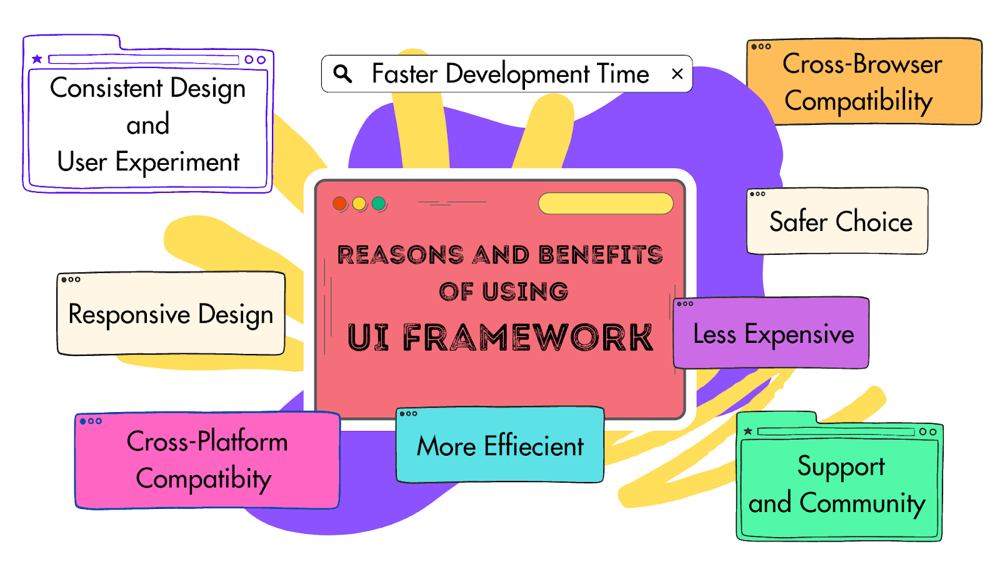

# Why bother to use something like Bootstrap 5 for UI development?

<div class="text-center p-4">
  
  
</div>

In the beginning of my webdevelopment career, I was exposed to the bare *HTML* and *CSS* first, which was really interesting and exciting. However, as we got deeper and deeper in the material, things got way complicated. Soon after, I was introduced to [Bootstrap 5](https://getbootstrap.com/docs/5.0/getting-started/introduction/), which is one of the most popular front-end frameworks used for web development. It includes elements from JavaScript, HTML, and CSS so that webdevelopment can be taken to another level. Initially I thought using Bootstrap 5 is a pain, however, it includes a lot of extras in a single component that would take multiple lines in HTML and CSS.

## The difficulty and simplicity of Bootstrap 5

There are multiple ways to do the same thing in Bootstrap 5. For example, creating a column can be achieved by using the the following methods:

```
- col → Creates a flexible column that automatically distributes space.
- col-* (e.g., col-6, col-4) → Creates a column that takes up a fixed fraction of the grid (out of 12).
- col-sm-*, col-md-*, col-lg-*, col-xl-*, col-xxl-* → Responsive column sizing 
(e.g., col-md-6 makes it  half-width on medium screens and larger).

- col-auto → Column size based on content width.
- col-12 → Forces full-width column.
``` 

The fact that there are so many options can be overwhelming. However, these properties make webdevelopment clean and neat, providing a consumer friendly website which is mostly easy to use and understand.

## Benefits of UI frameworks 

UI frameworks provide multiple advantages in software engineering, including accelerated development, uniform design across applications, and responsive components. They ensure cross-browser compatibility, minimize code redundancy, and enhance maintainability.Other benefits are shown on the picture below. 

<div class="text-center p-4 margin-bottom:30px">
  
  
</div>


As a conclusion, building websites is fun as long as you have the right tools to do that. Bootstrap 5 is a perfect and easy tool to use. Remember, practice makes perfect, and don't pull your hair too hard if you cannot get it right for the first time:)
