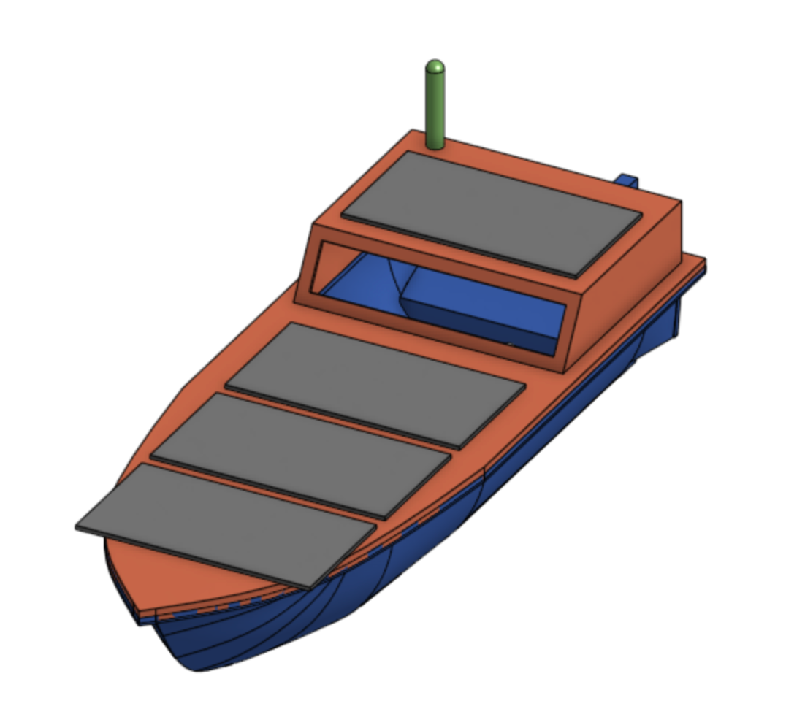

# **Project Overview**

This Balloon Satellite project involves designing the power system, sensing platform, and waterproof enclosure for a high-altitude payload operating in:

* **Near-space conditions** (to 100,000 ft / –70°F)
* **Extended mission durations**
* **Possible ocean splashdowns** (UHABS-style recovery)

The platform is built for robust, long-duration atmospheric data collection in extreme environments.

  

# **My Contributions**

Designed the power subsystem, sensor suite, and environmental protections, emphasizing thermal resilience and waterproofing.

# **Key Engineering Contributions**

## **1. Waterproof, Thermally Resilient Power System**

* Fully sealed, temperature-protected power architecture for –70°F and pressure drop
* Gasketed interfaces and internal mechanical isolation for battery safety
* Stable power delivery for avionics and sensors in low-pressure conditions

## **2. Solar Energy Harvesting & Charging**

* Integrated solar harvesting module + charge regulator
* Designed circuitry for safe high-altitude charging
* Implemented low-power standby modes to extend mission lifetime

  

## **3. Environmental Telemetry System**

* Multi-sensor array collecting: temperature, pressure, humidity, altitude, light
* I²C/SPI sensor integration with calibrated readings
* Real-time logging and telemetry pipeline for atmospheric data

# **Communication Link**

* Designed telemetry interfaces compatible with cellular or LoRa-WAN
* Built data-handling logic for ascent, peak altitude, descent, and landing

# **Testing & Validation**

**Environmental Testing:**

* Low-temperature chamber
* Pressure/altitude simulation
* Heat soak and humidity cycling

**Waterproofing & Impact:**

* Submersion testing
* Pressure-seal validation
* Drop/landing shock tests

**Power Validation:**

* Solar efficiency tests
* Battery runtime profiling
* Charge controller thermal tests

# **Results**

* Reliable power delivery in near-space thermal conditions
* Solar charging increased mission duration by >35%
* Sensors remained operational during full temperature and pressure cycles
* Enclosure survived multiple submersion and impact tests

# **Future Work**

* Add camera + IMU payload
* Larger solar array for longer missions
* Heater module or passive thermal buffer
* Move to a custom PCB-based avionics stack

# **Acknowledgements**

* UHABS Program
* Hawai‘i Space Flight Laboratory
* UH College of Engineering
* ME 482 Senior Design Resources

