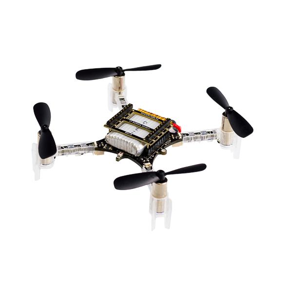

## Introduction 

Centimeter-scale robots face constraints in payload and power budgets [1]. Inspired by biological systems, deploying swarms of over ten heterogeneous robots can enable the execution of complex tasks beyond individual capabilities, such as distributed sensing and foraging [2]. Despite extensive research, homogeneous swarms of identical agents have not proven viable outside laboratory settings. We hypothesize that heterogeneous swarms, integrating multiple platform types, offer enhanced functionality and adaptability for real-world applications.
This project aims to design, build, and test a reduced-scale terrestrial swarm platform compatible with existing drone swarm systems. Leveraging the “Crazyflie” open-source hardware and software ecosystem ensures seamless integration with current swarm research infrastructures.

## Objectives 

The project focuses on three objectives:

- Incorporate Mecanum wheels into the Crazyflie platform, along with a custom motor driver, power management system, and odometry board. This setup will enable precise omnidirectional movement and enhanced maneuverability.
- Develop custom firmware as an extension of the Crazyflie architecture to command desired velocities to the wheeled platform. This firmware will utilize the holonomic drivetrain, interfacing with Electronic Speed Controllers (ESCs) and encoder feedback mechanisms for accurate and responsive motion control.
- Conduct tests to demonstrate interoperability between the new wheeled platforms and traditional flying drones within a unified swarm deployment. This involves adapting existing Crazyflie swarming workflows to support the heterogeneous mix of ground and aerial units, ensuring coordinated swarm behavior without significant protocol modifications.

Successfully achieving these objectives will advance the viability of heterogeneous robot swarms, enabling their deployment in diverse and dynamic environments beyond laboratory confines.

## Significance 

Easy access to an affordable and capable terrestrial platform is currently a major obstacle to swarm robotics research. Existing robots are either individually too limited to perform interesting real-world tasks (e.g., the Kilobot [3]), or are too expensive to be purchased in large numbers (e.g., the ePuck [4]). As a result, researchers are forced to develop their own platform before beginning swarm research; this process can take years, and the resulting robot is not easily transferable to other groups, and therefore neither is the research itself.  Motivated by this exact challenge, there has been some work on new open source platforms striking the middle ground between cost and function, like the HeRo [5]. The HeRo, however, still relies on custom firmware and software, has not seen widespread adoption and therefore has no widespread support network, and the developers have no financial incentive to maintain and document the platform. 
We have the opportunity to create the de-facto standard wheeled complement to the already essentially standardized micro air vehicle swarm platform, the Crazyflie. There are researchers around the world who would benefit from access to our platform. If we succeed, this could be an extremely impactful project with the potential to result in academic research papers, publicity through popular science (e.g., Hackaday) and robotics specific (e.g., the bitcraze blog) articles, and new collaboration opportunities with other researchers. 

## Process

#### Hardware Integration

To securely mount the Crazyflie core module, battery pack, and ESCs onto a wheeled base, a custom chassis adapter will be designed and 3D printed using Fused Deposition Modeling (FDM) technology on a Prusa MK3S+ in the Fablab. The ground robots will use ESCs that will be interfaced with the Bigquad deck of the Crazyflie. Optical Encoders will also be added to track movement accurately, which is essential for autonomous navigation and swarm coordination. 

#### Firmware and Control System Development

The development of custom firmware will be required that facilitates precise and dynamic control of the ground-based wheeled platform equipped with mechanum wheels. The firmware will take advantage of the unique capabilities of holonomic motion inherent to mechanum wheel configurations, namely the facilitation of omnidirectional movement allowing the robot to move seamlessly in any direction without the need to reorient its chassis. This movement capability will be achieved through the Electronic Speed Controller (ESC) signal lines as well as encoder feedback mechanisms to ensure accurate and responsive control.

#### Heterogeneous Swarm Deployment 

This part of the research focuses on developing and refining formation control strategies for a heterogeneous fleet of robots, integrating both stock-flying Crazyflies and a custom-designed wheeled platform. Utilizing the Lighthouse positioning system [6] for accurate real-time position feedback, the project aims to achieve precise coordination between aerial and ground robots. A centralized control architecture will be implemented through ROS2 [7], enabling efficient communication and decision-making. The CrazyChoir [8] software framework will be adapted to manage multi-robot dynamics, ensuring seamless formation control and collaboration across the heterogeneous group.

## References

[1] Mulgaonkar, Y., Whitzer, M., Morgan, B., Kroninger, C. M., Harrington, A. M., & Kumar, V. (2014, June). Power and weight considerations in small, agile quadrotors. In Micro-and Nanotechnology Sensors, Systems, and Applications VI (Vol. 9083, pp. 376-391). SPIE.

[2] Brambilla, M., Ferrante, E., Birattari, M., & Dorigo, M. (2013). Swarm robotics: a review from the swarm engineering perspective. Swarm Intelligence, 7, 1-41.

[3] Rubenstein, M., Ahler, C., & Nagpal, R. (2012, May). Kilobot: A low cost scalable robot system for collective behaviors. In 2012 IEEE international conference on robotics and automation (pp. 3293-3298). IEEE.

[4] Mondada, F., Bonani, M., Raemy, X., Pugh, J., Cianci, C., Klaptocz, A., ... & Martinoli, A. (2009). The e-puck, a robot designed for education in engineering. In Proceedings of the 9th conference on autonomous robot systems and competitions (Vol. 1, No. 1, pp. 59-65). IPCB: Instituto Politécnico de Castelo Branco.

[5] Rezeck, P. A., Azpurua, H., & Chaimowicz, L. (2017, November). HeRo: An open platform for robotics research and education. In 2017 Latin American Robotics Symposium (LARS) and 2017 Brazilian Symposium on Robotics (SBR) (pp. 1-6). IEEE.

[6] Alvarado-Marin, S., Huidobro-Marin, C., Balbi, M., Savić, T., Watteyne, T., & Maksimovic, F. (2024). Lighthouse Localization of Miniature Wireless Robots. IEEE Robotics and Automation Letters.

[7] Maruyama, Y., Kato, S., & Azumi, T. (2016, October). Exploring the performance of ROS2. In Proceedings of the 13th international conference on embedded software (pp. 1-10).

[8] Pichierri, L., Testa, A., & Notarstefano, G. (2023). Crazychoir: Flying swarms of crazyflie quadrotors in ros 2. IEEE Robotics and Automation Letters, 8(8), 4713-4720.
