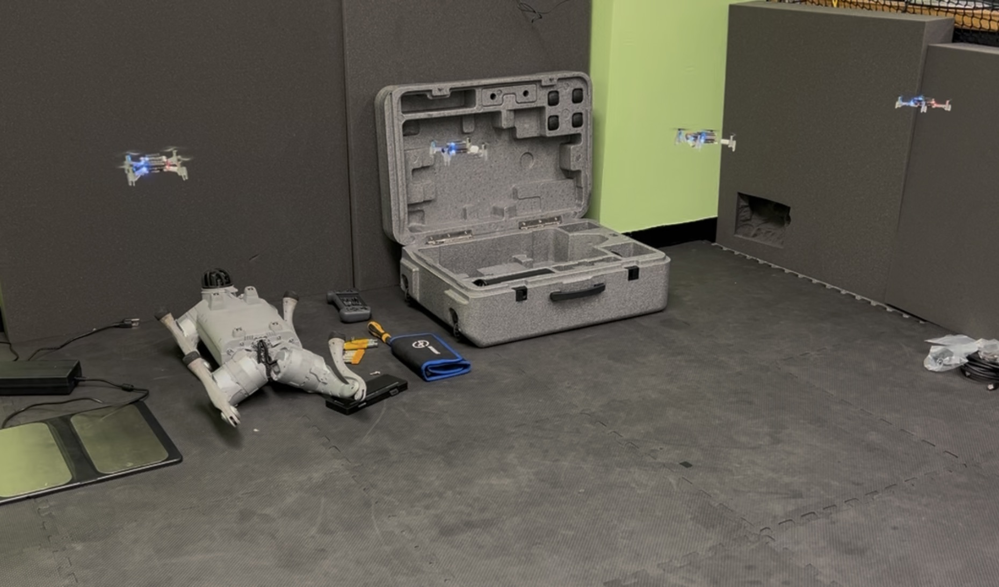

#  **Autonomous Robotics Control System – Heterogeneous Crazyflie + TurtleBot3 Swarm**

## **Project Overview**

This project develops a unified control, simulation, and autonomy framework enabling **heterogeneous swarm coordination** between **Crazyflie UAVs** and **TurtleBot3 ground robots**. The system integrates **ROS 2**, **Gazebo**, **sensor fusion**, and **reinforcement-learning-based controllers**, creating a scalable testbed for swarm robotics research.

## **Engineering Goals**

* Build a ROS 2 native control stack for multi-robot coordination.
* Integrate Crazyflie UAVs and TurtleBot3 platforms into shared formation control behaviors.
* Develop Python/C++ firmware extensions for real-time telemetry, sensing, and distributed control.
* Prototype a PyTorch reinforcement-learning controller to replace classical PID loops.
* Establish a simulation-first workflow in Gazebo to validate multi-agent algorithms before deployment.

## **System Architecture**

### **1. ROS 2 Control Framework**

* Custom ROS 2 nodes for:

  * Formation control
  * Trajectory tracking
  * Multi-robot communication
  * State estimation using LiDAR + IMU
* DDS-based communication for synchronized aerial/ground operation.

### **2. Firmware Development**

* Extended Crazyflie firmware in Python/C++ for:

  * High-rate sensor acquisition
  * Distributed telemetry logging
  * Real-time control input processing
  * Fleet-level coordination across robots

### **3. Gazebo Simulation Environment**

* Full simulation of:

  * Crazyflie UAV dynamics
  * TurtleBot3 ground robots
  * LiDAR + IMU sensor data
  * ROS 2 multi-agent interactions
* Supports:

  * Hardware-in-the-loop testing
  * RL controller evaluation
  * Parameter optimization

## **Machine Learning Integration**

### **Reinforcement Learning Flight Controller**

* Built PyTorch RL controller to optimize flight stability and PID behavior.
* Live inference executed directly within ROS 2 nodes.
* Trained using simulated disturbances and noise to improve robustness.
* Tested in Gazebo before deployment to physical Crazyflie hardware.

## **Heterogeneous Swarm Coordination**

* Crazyflie drones and TurtleBot3 platforms share:

  * Position and velocity information
  * Formation roles and task assignments
  * Mission-level commands
* Implemented formation shapes:

  * Line
  * V-shape
  * Column
  * Mixed-role leader–follower
* Ensures consistent behavior across:

  * Real hardware
  * Gazebo simulation
  * Hybrid (HIL) setups

## **Engineering Contributions**

* Designed ROS 2 swarm coordination pipeline.
* Developed real-time swarm communication using LiDAR/IMU fusion.
* Implemented distributed control for mixed UAV–ground robot teams.
* Built ML-in-the-loop controllers improving stability over classical PID.
* Created a reproducible, scalable research platform for future autonomous swarm studies.

## **Key Technologies**

**ROS 2**, **Python**, **C++**, **Gazebo**,
**Crazyflie Firmware**, **PyTorch**, **LiDAR/IMU Sensor Fusion**,
**Reinforcement Learning**, **Distributed Systems**, **Autonomous Navigation**

## **Results**

* Achieved stable real-time communication between aerial and ground robots.
* Demonstrated coordinated formation behaviors in simulation and hardware.
* Built a platform suitable for:

  * Multi-robot research
  * Controls experiments
  * Swarm autonomy education
  * ML testing in robotics

## **Future Work**

* Deploy RL controller on physical Crazyflie hardware for full closed-loop evaluation.
* Add localization sources (AprilTags, UWB).
* Extend swarm to >4 robots with hierarchical control layers.
* Publish the platform as an open-source heterogeneous swarm framework.
