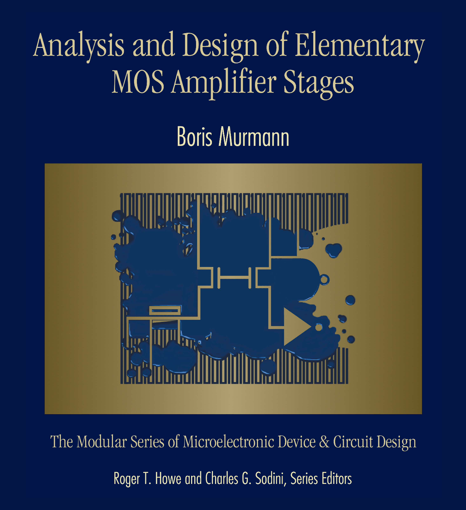

<div class="text-center p-4">
  
</div>

##  Intordution

I am collaborating with Boris Murmann on an interactive book project centered on MOSFET amplifier design. This initiative aims to provide a comprehensive learning resource for students and professionals by integrating theoretical explanations with practical applications. The book focuses on enhancing understanding of MOS amplifier stages and their design, offering an educational tool for both beginners and advanced learners in the field of microelectronics.

## Details

Using Markdown and Quarto, I further develop the book's format and incorporate embedded Python programs for hands-on learning. These interactive tools allow readers to visualize and simulate circuit behavior, deepening their grasp of basic microelectronics concepts. The book's first part has 6 chapters, the first one, and the html layout of the book was made by Professor [Claudio Taracio](https://www.gonzaga.edu/academics/faculty-listing/detail/claudio-talarico-phd-9eab2c67), I created chapter 2,3 and I am now working on chapter 4. My contributions emphasize creating an engaging and accessible educational resource that bridges the gap between theoretical knowledge and practical circuit design.

## Learned concepts

I touched upon markdown and the use of Github when I took EE 205, however, that was a while ago. Working on the book gave me a lot of experience, learning the details of markdown, quarto, [schemdraw](https://schemdraw.readthedocs.io/en/latest/usage/index.html), the command line, Github, and VScode. These tools helped me to learn the first step to be a good software engineer. 

Here is a piece of code as an example from the book. 

```
### [Bode Plots of Arbitrary System Functions with Real Poles and Zeros]{#bode-plots-of-arbitary-system-functions-with-real-poles-and-zeros}

For the case of real negative poles and zeros, and letting $s = j\omega$ , @eq-3.4 becomes

$$
H(j\omega) = K \frac{\left( 1 + j\frac{\omega}{\omega_{z1}} \right) \left( 1 + j\frac{\omega}{\omega_{z2}} \right) \dots \left( 1 + j\frac{\omega}{\omega_{zm}} \right)}{\left( 1 + j\frac{\omega}{\omega_{p1}} \right) \left( 1 + j\frac{\omega}{\omega_{p2}} \right) \dots \left( 1 + j\frac{\omega}{\omega_{pn}} \right)}
$${#eq-3.7}

where $\omega_{p1}, \omega_{p2},... \omega_{pn}$ are the pole frequencies and
$\omega_{z1}, \omega_{z2},..., \omega_{zm}$ are the zero frequencies. For
instance, in [Example 3-2](#example-3-2), we have

$$
H(j\omega) = K \frac{\left( 1 + j\frac{\omega}{\omega_{z1}} \right) }{\left( 1 + j\frac{\omega}{\omega_{p1}} \right) }
$${#eq-3.8}

where

$$
\omega_{z1} = \frac{1}{RC} \quad and \quad \omega_{p1} = \frac{1}{2RC}
$${#eq-3.9}

To determine the Bode plot from @eq-3.7, we
must assess the effect of each binomial term on the
magnitude and phase of the system function. If the
frequency is such that $\omega \ll \omega_{zi}$ or $\omega_{pi}$, then the
respective binomial term will have little effect on the
magnitude and phase of the system function, as it
will simply multiply it by unity. On the other hand, if
the frequency is such that $\omega \ll \omega_{zi}$ or $\omega_{pi}$, the system
function, magnitude, and phase will be altered. To
see this, we evaluate the magnitude and phase of a
general binomial term for a left half plane pole or
zero and $\omega \gg \omega_i$

$$
\left| 1 + j\frac{\omega}{\omega_i}\right| = \sqrt{1 + \left(\frac{\omega}{\omega_i}\right)^2} \simeq \frac{\omega}{\omega_i} 
$${#eq-3.10}

$$
\angle \left(1+ j \frac{\omega}{\omega_i}\right) = tan^{-1} \left(\frac{\omega}{\omega_i}\right) \simeq 90^\circ
$${#eq-3.11}

Therefore, if the binomial term is in the numerator
of the generalized system function (corresponding to
a LHP zero), the magnitude will be multiplied by
${\omega}/{\omega_i}$, and a phase angle of $90^\circ$ will be added to the
total phase. If the binomial term is located in the
denominator (LHP pole), the magnitude will be
multiplied by $1/({\omega}/{\omega_i})$ and a phase angle of $90^\circ$  will
be subtracted from the total phase. For a RHP zero,
it follows that the magnitude will be multiplied by
${\omega}/{\omega_i}$, and a phase angle of $90^\circ$  will be subtracted from
the total phase.
```

You can learn more at the [Boris Murmann's Github Repo](https://github.com/bmurmann/COCOA).
