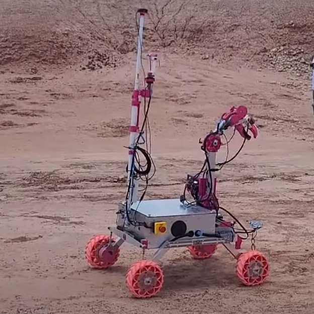
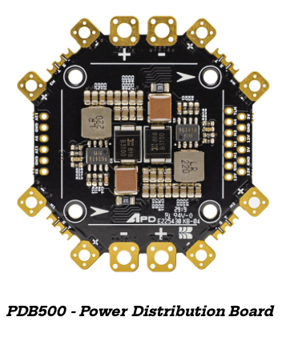
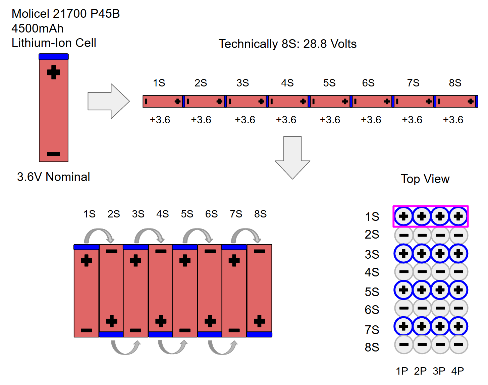
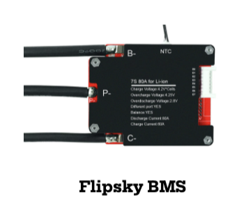

Team Robotic Space Exploration (RoSE) is a student-lead team of undergraduate STEM scientists and engineers, pursuing a common goal of developing a complex mars rover system for the University Rover Challenge (URC). In June 2024, Team RoSE qualified and competed in the URC Finals amongst the top 36 of 120 applying universities. This academic year, returning members have internalized results and observations made prior to improve upon all the critical failure points discovered. New members are also joining to get hands-on experience throughout this project.

  

## Project Description

4 URC Missions to test the limits of a Mars rover’s capabilities: 

**Extreme Delivery Mission** 
- The rover must assist astronauts by completing tasks such as locating, retrieving, and delivering objects while navigating progressively challenging terrains, up to 1 km away from the base station.
  
**Equipment Servicing Mission**
- The rover must navigate 0.25 km over flat terrain to perform various dexterous tasks on a mock-up equipment system.
 
**Autonomous Navigation Mission**
  - The rover must autonomously navigate to various GNSS and AR-marked locations within 30 to 60 minutes and a maximum distance of 2km, achieving success by stopping within 3 m of the designated locations.
   
**Science Mission**
- The rover must collect and evaluate samples at selected field sites using onboard instruments for potential microbial life with at least one life detection method in conjunction with geological context, while also storing at least one sample as a cache.

## Marterials and methods

The Avionics subteam enhanced the onboard electrical system to increase safety and reliability. A custom 8S-4P Li-ion 21700 battery was designed to handle extreme missions, powering the rover for over 4 hours with a capacity of 18Ah, a maximum output of 30V, and approximately 530Wh of energy. A PDB500 power distribution board ensures convenience and safety with several regulated 12V and 5V outputs and the ability to handle 500A continuous current, with a fuse box limiting current to 15A in case of stalls. Modularization across the rover facilitates quick and safe disassembly during competitions. Additionally, a new buck converter was implemented to address voltage dips that reset the Jetson AGX Xavier, providing a stable 15V nominal output.

  
  

## Result 

The Avionics subteam implemented significant upgrades to enhance the rover's performance and safety during field training and the University Rover Challenge (URC). A custom 8S-4P Li-ion battery with an integrated  Battery Management System (BMS) provided 530Wh and a nominal 29.6V, powering the rover for over three hours during training and handling hour-long URC missions under high loads with ease. An emergency button, made easily accessible, was extensively used during the competition to prevent rover damage, complemented by a fuse box that limited current draw to 15A in case of drive motor stalls. The power distribution board (PDB) was upgraded to a factory model, delivering robust 12V and 5V outputs with 125A per input and a total capacity of 500A. Enhanced wire management included custom connectors for cooling fans, a dedicated power source for the new Ethernet connection, and optimized wire lengths for safety and integration with mechanical updates. The omni charger was eliminated by wiring the Rocket M900 directly to the Jetson Xavier, while the emergency shutdown button was replaced with a more user-friendly version per URC judge recommendations. These upgrades, alongside finalized efficiency improvements, prepared the rover for optimal performance in Utah.

  

## Future Work 

Future work for the Avionics subteam includes implementing new batteries with greater capacity, higher current output, and improved heat resistance to enhance the rover's endurance and performance. A new Flipsky Battery Management System (BMS) will be integrated to ensure the new cells maintain consistent voltage and are protected from damage. Additionally, a breakout board will be developed for the electrical components housed in the arm box and the new payload box, which will accommodate several motor controllers and Arduinos. Efforts will also focus on improving modularity, wire management, and labeling to prioritize safety and streamline usage and maintenance.

  

## Conclusion 

Upon reflection from results in at the 2024 URC Finals, Team RoSE has set greater expectations and goals to improve upon the failure points in last year’s design. We are on track to develop a brand new rover, exceeding the limitations found in the 2024 Team RoSE mars rover. We have nearly  finalized all the designs and beginning next semester construction of the rover will start. The team must submit a video demonstrating the rover is capable of competing by early March. 

## Acknowledgements

- Dr. Matthew Siegler
- Dr. Frances Zhu
- Dr. Marvin Young
- Mr. Lewis Moore
- Protocase
- UHM College of Engineering
- SOEST
- HIGP
- UROP
- HSFL

You can learn more at the [UH Vertically Integrated Projects](https://manoa.hawaii.edu/uh-vip/project/robotic-space-exploration-rose-vip/).
